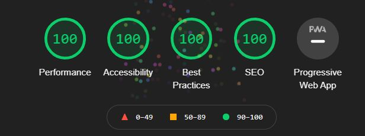

This is the source for a psychologist website with a Ligthouse score of 100.  
[Psychotherapi Dohm](http://psychotherapiedohm.de/)

## Getting Started

This website get's the data from a strapi CMS which is configured via environment variable `NEXT_PUBLIC_STRAPI_API_URL`. You can find the api endpoints (and maybe other endpoints for other projects) at [lmachens/cms](https://github.com/lmachens/cms).

### Lighthouse score

### Technologies

- Next.js
- Bootstrap@5
- remark (Markdown to HTML)
